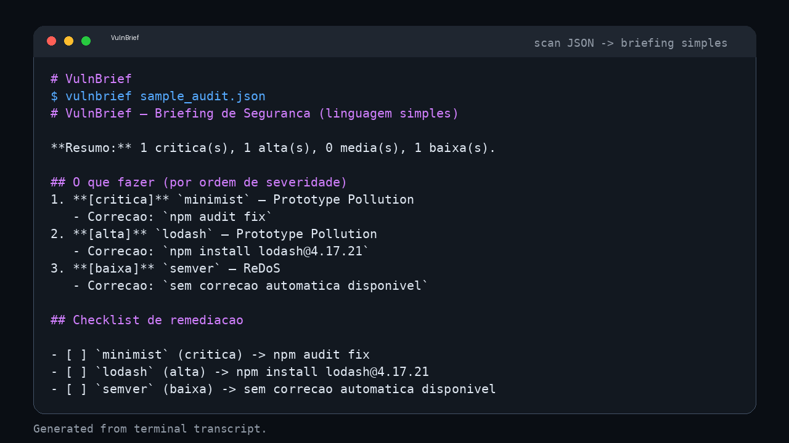

<!-- AGENT-FIRST NOTICE -->
> [!IMPORTANT]
> ### 🤖 Leia isto com seu agente de IA — não leia à mão.
> Este repositório é escrito agent-first. Aponte Claude Code, GitHub Copilot, Cursor ou qualquer agente para ele:
> *"Leia o README e o AGENTS.md, depois instale e use esta skill."*
<!-- /AGENT-FIRST NOTICE -->

<div align="center">

# 🛡️ VulnBrief

### Transforme a saída de um scan de segurança (`npm audit --json`, SBOM, lista de CVEs) em um **briefing em linguagem simples** + **checklist de remediação** para devs não-especialistas.

[](LICENSE)
[](https://python.org)
[](#testes)

</div>

## O problema

Scans de segurança (npm audit, trivy, syft, SCA) vomitam JSON técnico que o dev comum não entende — e vira ticket ignorado. **Gap real** (busca no GitHub): `cve plain language explainer` = 1 repo, `sbom remediation cli` = 2, `pentest report generator cli` = 2. Ninguém entrega um CLI **zero-config** que pega o JSON que o dev *já tem* e emite um briefing + checklist acionável.

> Ângulo 10x: entra o JSON do scan → sai briefing em português simples + checklist acionável. Audience Flip (segurança para dev não-especialista) + Format Shift (JSON → Markdown legível).

## Instalação

```bash
git clone https://github.com/matheus24scc/VulnBrief.git
cd VulnBrief
pip install -e .
```

## Uso

```bash
npm audit --json > audit.json
vulnbrief audit.json
# imprime o briefing; use --out briefing.md para salvar
```

### Como biblioteca

```python
from vulnbrief.parser import parse
from vulnbrief.brief import render
data = parse(open("audit.json", encoding="utf-8").read())   # aceita str JSON ou dict
print(render(data))
```

## Exemplo de saída

```markdown
# VulnBrief — Briefing de Seguranca (linguagem simples)

**Resumo:** 1 critica(s), 1 alta(s), 0 media(s), 1 baixa(s).

## O que fazer (por ordem de severidade)
1. **[critica]** `minimist` — Prototype Pollution
   - Correcao: `npm audit fix`
2. **[alta]** `lodash` — Prototype Pollution
   - Correcao: `npm install lodash@4.17.21`

## Checklist de remediacao
- [ ] `minimist` (critica) -> npm audit fix
- [ ] `lodash` (alta) -> npm install lodash@4.17.21
- [ ] `semver` (baixa) -> sem correcao automatica disponivel
```

## Como funciona

- `vulnbrief/parser.py` — lê o JSON de vulnerabilidades (formato `npm audit --json`) e extrai pacote, severidade, título e correção; ordena por severidade.
- `vulnbrief/brief.py` — gera Markdown com resumo, passos por severidade e checklist.
- `vulnbrief/cli.py` — interface de linha de comando (argparse).


## Demo



> GIF animado: [vulnbrief-demo.gif](assets/vulnbrief-demo/vulnbrief-demo.gif) — execucao real do CLI.

## Testes

```bash
pytest -q
```

Oracle verde: contagem por severidade, ordenação, comandos de correção e presença de todos os pacotes no briefing.

## Roadmap

- [ ] Ingestão de SBOM (CycloneDX/Syft) e saída de `trivy`
- [ ] Busca de CVE id → explicação enriquecida (modo online, opcional)
- [ ] Modo MCP server (expor `brief` como tool)

## Licença

MIT — veja [LICENSE](LICENSE).

## Status (checkup 2026-08-18)
> Revisado na campanha de repo-checkup. Relatorio completo: `~/repo-checkup/reports/VulnBrief.md` (local do mantenedor, nao no repo).
- **Build/Install**: PASS — `pip install -e .` RC=0 (wheel editável `vulnbrief-0.1.0`); também `pip install -e ".[dev]"` (`dev` adicionado no checkup).
- **Smoke test**: PASS — `python -m pytest -q` 4 passed; `python scripts/smoke.py` PASS (parse de findings, ordem por severidade, comando de fix, briefing).
- **Para rodar de ponta-a-ponta precisa de**: nenhum serviço externo (CLI Python puro; `pip-audit` opcional).
- **Inconsistencias conhecidas (README vs codigo)**: nenhuma (relatório não cita README vs código; `AGENTS.md`/`llms.txt` tinham placeholders "Unknown stack" corrigidos no checkup).
- **Seguranca**: sem vulns altas remediadas automaticamente (`pip-audit`: nenhuma vulnerabilidade conhecida; secret scan: nenhum segredo).
- **Estado resumido**: build verde + smoke; CLI Python puro; sem serviços externos; sem vulnerabilidades.
